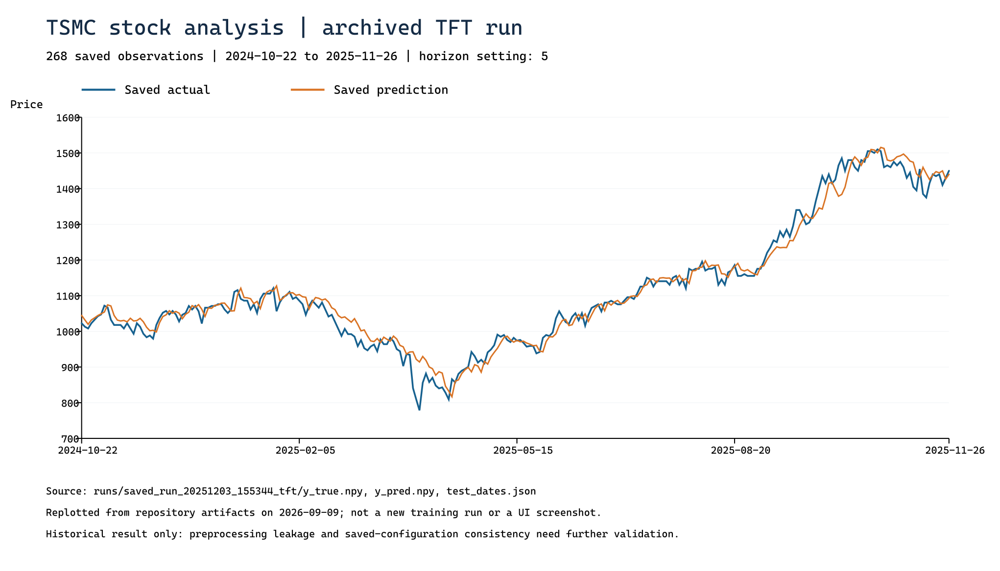

# TSMC Stock Prediction

台積電股價時間序列分析與模型比較原型。專案使用 Python、Flask、PyTorch 與 Plotly，整合行情資料、技術指標、Transformer／TFT-style 模型訓練、預測圖表及歷次實驗結果，讓使用者能從網頁設定分析條件並查看結果。

本專案定位為具網頁介面的資料分析工具與研究原型。它呈現從資料處理、模型訓練到結果展示的整合過程；目前沒有券商下單、交易執行或經成本驗證的投資績效。

## 先看圖文成果



藍線是真實值、橘線是預測值。此圖由既有 Run 的 268 筆保存資料重繪，**不是本次重新訓練、不是網頁截圖，也不是投資績效**；前處理與切分一致性仍有待驗證。

[**初學者圖文指南：看懂曲線、參數、操作步驟與誤差指標**](docs/visual-guide.md)

## 專案可以做什麼

| 功能 | 使用方式與程式依據 |
| --- | --- |
| 行情與技術圖表 | 以 `2330.TW` 為預設標的；輸入資料期間，查看價格、成交量、RSI、MACD 等圖表。資料由 `data_fetch.py` 取得，指標由 `ta_features.py` 計算 |
| 調整模型條件 | 網頁可設定預測跨度 Horizon、輸入視窗 Window、Epochs 及進階參數 |
| 比較兩種模型 | 使用 `Train Transformer`、`Train TFT` 或 `Train Both & Compare` 進行訓練及展示。雙模型操作依序訓練，並非並行執行 |
| 查看預測與診斷 | 圖表及結果區可呈現真實值與預測值、誤差與方向指標、基準比較及學習曲線；可顯示的內容取決於該次結果實際保存的欄位 |
| 保存與讀取實驗 | `runs/` 保存設定、數值陣列與 JSON；網頁讀取既有結果時使用 `load_run_results`，不會重新訓練或重新推論 |

「程式中有此流程」與「已在新環境實測通過」是不同層級。本說明根據程式、既有實驗檔案及 2026-09-17 完成的封存回測整理。資料品質、自動測試與 CPU 訓練流程均已執行；這仍是研究原型，不是投資建議。

## 系統組成與製作流程

1. **資料輸入**：由網頁收集股票代號、起訖時間及分析參數，取得 OHLCV 行情。Yahoo Finance 是主要來源；部分路徑具有 Alpha Vantage 或臺灣證交所的補充處理，仍受資料可用性影響。
2. **特徵處理**：計算均線、RSI、MACD、布林通道、報酬率、波動與日曆等特徵，建立滑動視窗及預測目標。程式也包含事件倒數與基本面相關處理，但不能假設所有介面選項均在每條訓練路徑生效。
3. **模型訓練**：`run_training` 分流至 Transformer Seq2Seq 或 TFT-style 路徑。`tft_model.py` 以 PyTorch 組合變數門控、LSTM 編碼／解碼、多頭注意力及分位數輸出；屬專案中的 TFT-style 實作，尚未證明與原始 TFT 論文完全等價。
4. **結果展示**：Flask 將訓練結果交給 Jinja 模板與 Plotly，呈現預測曲線、指标與診斷資訊。
5. **實驗留存**：將設定、預測陣列、日期、指標及可用診斷資料存入 `runs/`，供後續回顧與比較。

## 資料品質與結果核對

新取得的每一份行情資料都會先通過 `data_quality.py` 的 OHLCV 稽核，再進入特徵與模型流程。檢查內容包括必要欄位、日期有效性與順序、重複日期、缺值／無限值、正價格、High／Low 合理範圍及非負成交量。稽核報告會附在資料物件，新的訓練結果也會將報告寫入 `split_info`。

本次修正的防洩漏原則：

- Yahoo Finance 調整後行情不再與證交所未調整行情逐列混接；主要來源完整失敗時才切換來源。
- 觀察特徵只允許向前填補，不使用會把未來數值帶回過去的 `bfill`。
- Transformer 與 TFT-style 的輸入標準化只以最終訓練分割擬合，再套用到驗證、測試與未來輸入。
- 新的切分紀錄同時保存要求的比例、實際比例、規則、日期區間與來源稽核報告，方便追查設定是否一致。

可用以下命令核對一個已保存的 Run；成功回傳碼為 0，不一致則為 1，並可輸出 JSON 報告：

```powershell
python scripts/audit_saved_run.py runs/<run-id> --output audit.json
```

稽核會重新計算 MSE、RMSE、MAE，核對預測／真實值／日期數量與日期順序，並比較 `config.json`、`split_info.json` 的切分比例和測試日期。它只證明保存檔案彼此一致，不等於模型具有投資獲利能力。

## 2026-09-11 封存四日回測

這項測試將可見資料鎖定在 2026-09-11（星期五），直接預測 09-14 至 09-17 四個交易日。模型產生預測後才載入四日實際價格評分，因此本週價格不會進入特徵、縮放或模型訓練。歷史評估先使用互不重疊的訓練／驗證／測試標籤；產生未來預測前，再使用截至 09-11 已知的全部 1,252 個監督樣本微調六輪。

模型輸入與誤差使用 Yahoo Finance 調整後收盤價，避免除息造成不連續；表格同時保留交易所原始收盤價。依專案目標，checkpoint 以截止日前驗證集 MAE 選擇，Transformer 使用 Huber loss，沒有用四日實際價格回頭調參。完整參數、逐日數值與限制請見 [`docs/results/asof-backtest-2026-09-11.md`](docs/results/asof-backtest-2026-09-11.md)。

| 方法 | 四日 MAE | 四日 RMSE | 每日方向正確率 | 與最後收盤基準比較 |
| --- | ---: | ---: | ---: | --- |
| 60 日線性趨勢 | 17.03 | 21.23 | 25% | 單次四日最佳 |
| TFT-style | 20.43 | 21.89 | 25% | 優於最後收盤基準 |
| 最後收盤不變基準 | 24.96 | 25.14 | 0% | 基準 |
| 20 日均價 | 25.46 | 25.71 | 0% | 較差 |
| Transformer | 27.37 | 28.03 | 0% | 較差 |
| 5 日均價 | 54.80 | 58.67 | 0% | 較差 |

這四天不能用來宣稱模型有效：TFT-style 在價格 MAE 上勝過最後收盤基準，但簡單線性趨勢又勝過 TFT-style；Transformer 沒有勝過基準。

另外以最近 20 個互不重疊四日區間（共 80 個樣本）測試四種價格基準，最後收盤不變以 MAE 49.22 排名第一，線性趨勢則為 62.19、排名最後。因此，線性趨勢在上述單一四日勝出只是局部現象。深度模型的下一個可信門檻，是在相同 20 區間流程中穩定低於 49.22，而不是只挑一週展示。完整基準報告見 [`docs/results/rolling-price-baselines-2026-09-17.md`](docs/results/rolling-price-baselines-2026-09-17.md)。

縮小版模型接著完成 20 區間 × 3 種子測試，共 120 次訓練、480 筆預測。Transformer 三個種子的 MAE 為 49.01、49.13、48.82，依預定數值規則皆低於 49.22；TFT-style 為 48.61、49.25、49.05，其中一個種子未通過。不過兩模型相對基準的成對 bootstrap 95% 信賴區間全部跨過零，因此不能宣稱已有明顯優勢。完整方法與逐種子結論見 [`docs/results/rolling-models-20x3-2026-09-17.md`](docs/results/rolling-models-20x3-2026-09-17.md)。

重跑命令：

```powershell
python scripts/asof_backtest.py --cutoff 2026-09-11 --actual-end 2026-09-17 --epochs 12
python scripts/rolling_price_baselines.py --end 2026-09-17 --periods 20 --horizon 4
python scripts/rolling_model_backtest.py --periods 20 --seeds 11,42,97 --models transformer,tft --epochs 4 --refit-epochs 2 --d-model 32
```

## 專案角色與實作能力

依製作者林琨茂的專題說明，本專案由其個人發想與製作，開發過程大量使用 AI 協助程式產生、修改與文件整理。此作品用來呈現需求規劃、資料分析、模型與網頁整合的實作經驗。程式存在與實驗檔案本身不等於每個模組均獨立手寫，也不代表提出新的模型架構。

適合在專題展示時說明的內容包括：如何將股價問題拆成資料、特徵、模型和展示流程；如何設定輸入視窗與預測跨度；如何讀取歷次結果；以及如何辨認指標、資料切分和實作限制。

## 本機啟動

倉庫提供可安裝的 `requirements.txt`；目前使用相容版本範圍而非逐套件雜湊鎖定。PyTorch 仍須配合 Python、作業系統與 CPU／GPU 環境選擇。

```powershell
git clone https://github.com/Neptgear/TSMC-Stock-Prediction.git
cd TSMC-Stock-Prediction
python -m venv .venv
.\.venv\Scripts\python.exe -m pip install -r requirements.txt
.\.venv\Scripts\python.exe -m flask --app app:create_app run --host 127.0.0.1 --port 5000
```

在瀏覽器開啟 `http://127.0.0.1:5000`。私人倉庫需有 GitHub 存取權限才能複製。網頁圖表若使用外部 Plotly 資源，還需要對應的網路連線。

Alpha Vantage 為選用資料來源，可使用 `ALPHAVANTAGE_API_KEY` 環境變數，或參考 `secrets_local.example.py` 建立未提交的本機設定；不要把實際金鑰貼入說明或提交到版本控制。

### 操作順序

1. 先以 `Fetch` 確認股票與資料期間能取得資料。
2. 選擇 Horizon、Window、Epochs，使用 Custom 時確認進階參數；選用 Preset 會覆寫部分設定。
3. 執行單一模型或 `Train Both & Compare`；訓練在請求中進行，CPU 執行可能需要等待。
4. 查看結果與診斷，使用介面的儲存功能留下本次實驗。
5. 從既有 Run 選擇紀錄後讀取，這一步展示已保存的結果，不是對當下股價重新預測。頁面其他行情流程仍可能存取網路，不能因此宣稱整個網頁可離線使用。

命令列也可啟動訓練，例如：

```powershell
python train_transformer.py --ticker 2330.TW --start 2020-01-01 --horizon 5 --window 90 --epochs 10 --model_type tft
```

## 如何閱讀已保存的成果

以 [`saved_run_20251203_155344_tft`](runs/saved_run_20251203_155344_tft) 為例，倉庫保存 268 筆真實值與預測值。根據 `test_dates.json`，圖表日期為 2024-10-22 至 2025-11-26。由 `y_true.npy`、`y_pred.npy` 重新計算的 RMSE 約 29.891、MAE 約 21.633，與該資料夾 `metrics.json` 的對應數值一致；這只是對歷史數值檔案的核算，不是重新訓練或外部樣本驗證。

| 檔案 | 內容 |
| --- | --- |
| `config.json` | 當次儲存的設定資訊 |
| `y_true.npy`、`y_pred.npy` | 已保存的真實值與預測值，可用 NumPy 讀取 |
| `test_dates.json` | 上述結果使用的日期標籤 |
| `metrics.json` | 誤差與方向分類指標；不是交易收益 |
| `split_info.json` | 訓練、驗證與測試區間的紀錄 |
| `diagnostics.json` | 部分實驗保存基準、學習曲線與其他診斷 |

既有 Run 不應一律視為完整模型檢查點；目前所核對的倉庫樹沒有 `model.pt` 與 scaler 檔案。讀取保存曲線可使用陣列，但不能假定可用這些 Run 對新資料重新推論。

## 已知限制與後續改進

- **新舊結果必須分開解讀**：主要 Transformer／TFT-style 路徑已移除 `bfill`，並改為只用訓練分割擬合輸入標準化；既有 Run 是修正前產物，不會被改寫，也不能用新流程替它背書。
- **歷史保存設定存在不一致**：上述 Run 的 `config.json` 記錄 `train_ratio=0.6`，`split_info.json` 卻記錄 `ratio_samples_0.80`，測試日期範圍也與 `test_dates.json` 不同。新的稽核工具會把這類情況判定為失敗；該歷史 Run 僅能作為介面與保存格式展示，不能當作已驗證的泛化結果。
- **部分進階參數需逐路徑確認**：介面存在 Walk Splits、Split Mode 與基本面選項，但主要 Seq2Seq／TFT 分流並不等同於後面的舊訓練路徑；不能將所有選項標為已驗證有效。
- **模型屬研究實作**：TFT-style 與 Transformer 需要進一步做基準、消融及獨立時段測試；預測曲線與歷史方向指標不構成交易獲利證明。
- **數值略勝不等於明顯勝出**：Transformer 已在 20 個 rolling-origin 區間的三個種子中數值略低於基準，但改善幅度小且95%信賴區間跨零；TFT-style另有一個種子未過門檻。
- **部署與推論封裝仍待補齊**：新的封存回測可重跑，但尚未把模型權重、scaler、環境雜湊與完整資料快照封裝為可直接部署的版本化產物。
- **交易日曆仍可加強**：目前未來日期使用一般工作日，尚未整合臺灣證交所休市日曆；本次 09-14 至 09-17 不受影響。

## 主要檔案

| 路徑 | 職責 |
| --- | --- |
| [`app.py`](app.py) | Flask 入口、介面參數、模型呼叫、實驗保存 |
| [`templates/index.html`](templates/index.html) | 參數表單、結果區及 Plotly 圖表 |
| [`data_fetch.py`](data_fetch.py) | 行情、基本面與事件資料處理 |
| [`data_quality.py`](data_quality.py) | OHLCV 與保存 Run 的一致性稽核 |
| [`ta_features.py`](ta_features.py) | 技術特徵與時間序列視窗工具 |
| [`train_transformer.py`](train_transformer.py) | 訓練分流、模型、指標及診斷 |
| [`tft_model.py`](tft_model.py) | TFT-style PyTorch 模型組件 |
| [`runs_utils.py`](runs_utils.py) | Run 清單、歷史結果讀取及相關工具 |
| [`scripts/audit_saved_run.py`](scripts/audit_saved_run.py) | 命令列結果核對工具 |
| [`scripts/asof_backtest.py`](scripts/asof_backtest.py) | 截止日封存、多步預測與事後評分工具 |
| [`scripts/rolling_price_baselines.py`](scripts/rolling_price_baselines.py) | 多期間價格基準與 MAE／RMSE 排名工具 |
| [`scripts/rolling_model_backtest.py`](scripts/rolling_model_backtest.py) | 多模型、多種子 rolling-origin 測試與可續跑結果保存 |
| [`tests/test_data_quality.py`](tests/test_data_quality.py) | 資料品質與 Run 稽核測試 |
| [`tests/test_multihorizon_alignment.py`](tests/test_multihorizon_alignment.py) | 多步日期、目標對齊與切分隔離測試 |
| [`docs/results/asof-backtest-2026-09-11.md`](docs/results/asof-backtest-2026-09-11.md) | 2026-09-11 截止的四日實測報告 |
| [`docs/results/rolling-price-baselines-2026-09-17.md`](docs/results/rolling-price-baselines-2026-09-17.md) | 20 個四日區間的價格基準報告 |
| [`docs/results/rolling-models-20x3-2026-09-17.md`](docs/results/rolling-models-20x3-2026-09-17.md) | 120 次模型訓練與信賴區間報告 |
| [`runs/`](runs/) | 已保存的實驗資料 |

說明最後核對：2026-09-17。本次同時修改資料取得、主要訓練前處理、結果稽核工具與測試；既有歷史 Run 保留原狀。

