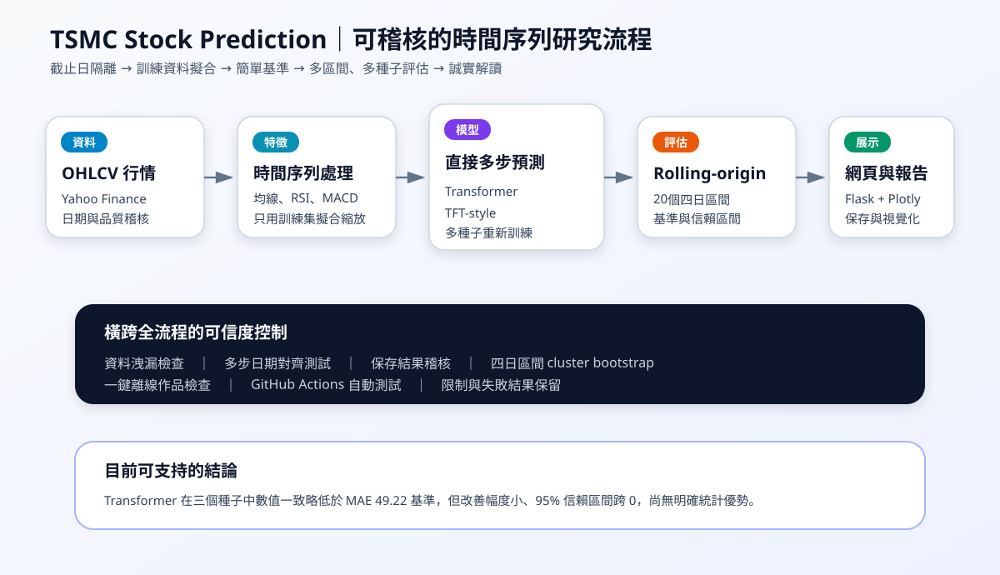
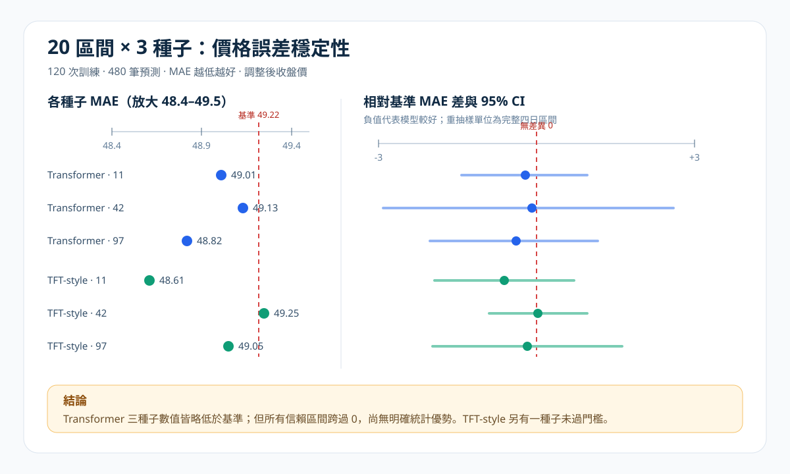

# 台積電股價預測研究原型：推甄作品說明

## 作品定位

本作品是以台積電（2330.TW）為案例的時間序列研究原型與網頁分析工具。它整合行情取得、技術特徵、Transformer／TFT-style 模型、基準比較、實驗保存與圖表展示。

研究問題不是「能不能保證預測股價」，而是：**在嚴格限制資料只能看到截止日以前的條件下，深度模型的價格誤差能否穩定低於簡單基準？**

這個問題讓我從「把模型跑出結果」進一步學習如何設計可驗證、可反駁、可重現的實驗。

## 個人角色與 AI 使用說明

本專案由林琨茂個人發想、規劃與製作。我的工作包括：

- 將股價分析需求拆成資料、特徵、模型、評估與網頁展示模組。
- 整合 Yahoo Finance 行情、技術指標、Transformer 與 TFT-style 訓練流程。
- 設計 Flask 操作介面、參數輸入、圖表呈現與實驗保存方式。
- 發現並修正資料洩漏、多步預測日期對齊與訓練／測試前處理問題。
- 建立簡單價格基準、rolling-origin 回測、多隨機種子測試與信賴區間。
- 撰寫操作、實驗、限制與初學者文件，讓結果可以被他人檢查。

開發過程大量使用 AI 協助產生程式草稿、除錯、測試與文件整理；需求判斷、功能取捨、實驗目標、結果核對與最後整合由我負責。本作品不宣稱自行提出 Transformer 或 TFT 新架構。

## 系統流程



1. **資料層**：取得 OHLCV 行情，檢查日期、缺值、重複列與價格範圍。
2. **特徵層**：建立均線、RSI、MACD、報酬率、波動與時間相關特徵。
3. **訓練層**：以 Transformer 或 TFT-style 進行直接多步價格預測。
4. **評估層**：比較最後收盤不變、移動平均與線性趨勢等簡單基準。
5. **展示層**：透過 Flask 與 Plotly 顯示行情、模型結果、誤差和保存紀錄。
6. **稽核層**：使用自動測試、保存結果核對與離線作品檢查降低錯誤。

## 最重要的工程修正

### 1. 防止資料洩漏

早期流程存在以未來資訊回填缺值，以及可能在切分前擬合標準化參數的風險。修正後只允許向前填補，並且只用訓練分割擬合 scaler，再套用到驗證與測試資料。

### 2. 修正多步預測對齊

多日預測若把第一個目標錯接到輸入視窗最後一天，會讓看似合理的曲線實際比較錯誤日期。專案加入日期與目標對齊測試，確認第一個預測值對應截止日後第一個交易日。

### 3. 先建立簡單基準

單看模型 MAE 無法判斷模型是否真的有價值。因此我加入「最後收盤不變」、5／20日均價與60日線性趨勢。最近20個四日區間中，最後收盤基準 MAE 為49.22，是深度模型必須先超越的門檻。

### 4. 從單週展示改為多區間測試

單一四日測試可能只是剛好選到有利時段。後續測試改為20個互不重疊四日區間、3個隨機種子、2種模型，共120次訓練與480筆預測。

### 5. 保留同一期間內的相依性

同一四日區間內的誤差不是完全獨立，因此信賴區間以「完整四日區間」為 cluster bootstrap 抽樣單位，而不是把80個每日誤差任意拆散重抽。

## 實驗結果

| 模型 | 種子 MAE | 是否每個種子都低於49.22 | 統計結論 |
| --- | --- | --- | --- |
| Transformer | 49.01、49.13、48.82 | 是 | 數值一致略低，但95%信賴區間都跨0 |
| TFT-style | 48.61、49.25、49.05 | 否 | 有一個種子未通過，信賴區間也都跨0 |



最準確的結論是：**Transformer 在本次縮小模型篩選中數值一致略勝基準，但改善很小，還不能宣稱已具有明確統計優勢。**

這個結果並不漂亮，但比只展示一張貼近真實曲線的圖片更可信。它也讓下一步工作有明確方向：擴增評估區間、改善有理據的特徵，並要求信賴區間上界低於零，而不是只增加 epochs。

## 可驗證證據

| 證據 | 能證明什麼 |
| --- | --- |
| [`scripts/asof_backtest.py`](../scripts/asof_backtest.py) | 截止日封存與事後四日評分流程 |
| [`scripts/rolling_price_baselines.py`](../scripts/rolling_price_baselines.py) | 多區間簡單價格基準 |
| [`scripts/rolling_model_backtest.py`](../scripts/rolling_model_backtest.py) | 兩模型、三種子、rolling-origin測試 |
| [`scripts/audit_saved_run.py`](../scripts/audit_saved_run.py) | 保存結果、日期與指標一致性核對 |
| [`scripts/verify_portfolio.py`](../scripts/verify_portfolio.py) | 文件、圖表、程式與測試的一鍵離線檢查 |
| [`tests/`](../tests) | 資料品質、日期對齊、防洩漏、基準與網頁啟動測試 |
| [完整20×3報告](results/rolling-models-20x3-2026-09-17.md) | 參數、逐種子數值、信賴區間與限制 |

離線核對指令：

```powershell
python scripts/verify_portfolio.py --with-tests
```

## 三分鐘展示腳本

1. **30秒說明問題**：我不是直接宣稱模型能預測股價，而是先問它能否在看不到未來資料的條件下穩定勝過最後收盤基準。
2. **45秒說明系統**：展示架構圖，說明行情、特徵、模型、評估、網頁與稽核六個部分。
3. **45秒展示操作**：開啟網頁，指出股票代號、Window、Horizon、模型選擇、訓練與保存結果。
4. **40秒展示實驗**：打開20區間三種子圖，說明Transformer三個種子數值略勝，但信賴區間跨0。
5. **20秒收尾**：強調我學會的不只是串接模型，而是發現資料洩漏、建立基準、設計重複實驗並誠實解讀限制。

## 教授可能追問

**為什麼不能說模型已經優於基準？**  
雖然Transformer三個種子的平均絕對誤差都略低於49.22，但幅度只有約0.09至0.39元，而且四日區間cluster bootstrap信賴區間均跨0，差異可能來自抽樣波動。

**為什麼仍保留TFT-style？**  
它是模型比較的一部分，也呈現不同隨機種子下的穩定性問題。保留失敗結果比只挑最好的一次更能證明實驗完整性。

**大量使用AI，自己的能力在哪裡？**  
AI協助我加速程式草稿與除錯，但我必須定義問題、判斷資料切分是否合理、決定用什麼基準、設計測試、核對輸出並對結果負責。這些決策形成了完整系統，而不只是單一程式片段。

**下一步會怎麼做？**  
先擴增rolling-origin區間，接著對特徵群組做消融實驗；只有在不同區間與種子下都產生實質改善，才進行更大型模型訓練。

## 限制與倫理

- 本作品是研究與工程原型，不是投資建議，也沒有下單功能。
- 回測沒有涵蓋交易成本、滑價與實際資金管理。
- 價格資料來源可能調整歷史數值，重跑時應記錄資料日期與版本。
- 舊保存Run屬修正前產物，只能作為介面與格式展示，不能替新流程背書。
- 目前結果尚未證明深度模型具有足以實務使用的穩定優勢。

